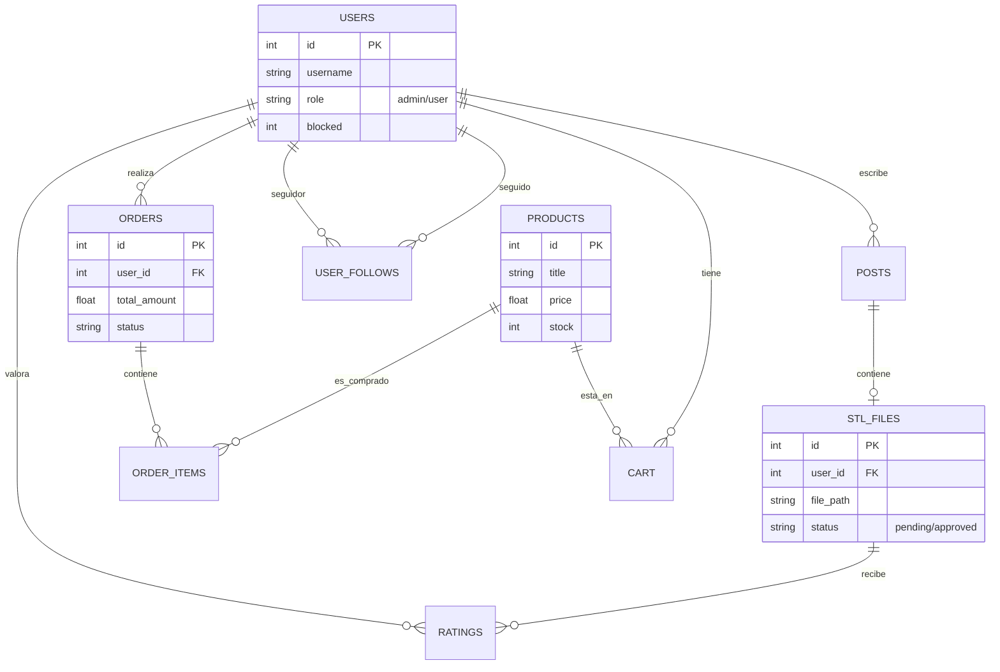

# Base de Datos y Modelo de Datos

LayerHub utiliza **SQLite 3** para la persistencia de datos, lo que permite una configuración rápida sin necesidad de servidores de base de datos complejos.

## 📊 Diagrama de Entidad-Relación

A continuación se muestra cómo se relacionan las entidades principales del sistema:

## 📋 Detalle de Tablas Principales

### Tabla `users`
Almacena los perfiles de usuario y sus credenciales (contraseñas hasheadas con BCRYPT).
- `role`: Define si el usuario es `user` (cliente) o `admin`.
- `blocked`: Flag binario para restringir el acceso a usuarios conflictivos.

### Tabla `products`
Define el catálogo de la tienda. Los productos tienen stock dinámico que se descuenta automáticamente tras cada compra confirmada.

### Tabla `stl_files` y `posts`
Los archivos STL se vinculan a un `post` en la comunidad. Tienen un campo `status` que permite la moderación previa por parte de un administrador antes de ser públicos.

### Tabla `user_follows`
Implementa la relación muchos-a-muchos para el sistema de seguidores, permitiendo a los usuarios suscribirse a las actualizaciones de sus creadores favoritos.

## 💾 Persistencia
La base de datos se encuentra físicamente en `db/layerhub.sqlite`. El acceso se realiza a través de **PDO** para prevenir inyecciones SQL mediante consultas preparadas.
