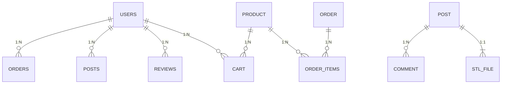

# Infraestructura de Datos

El sistema de persistencia se basa en **SQLite 3**, gestionado a través de la interfaz **PDO** de PHP. Este diseño garantiza la integridad referencial y permite transacciones ACID.

## Esquema Relacional Completo

A continuación se detalla la estructura de todas las tablas del sistema, incluyendo sus claves primarias (PK), foráneas (FK) y restricciones de integridad.

### 1. Tabla `users` (Usuarios)
Almacena las credenciales y perfiles de todos los actores del sistema.

| Campo | Tipo | Restricciones | Descripción |
| :--- | :--- | :--- | :--- |
| `id` | INTEGER | PK, AUTOINCREMENT | Identificador único. |
| `username` | TEXT | UNIQUE, NOT NULL | Nombre de usuario para login. |
| `password` | TEXT | NOT NULL | Hash BCRYPT de la contraseña. |
| `role` | TEXT | CHECK('user', 'admin') | Nivel de acceso. |
| `blocked` | INTEGER | DEFAULT 0 | Flag de bloqueo (1=Bloqueado). |

### 2. Tabla `products` (Catálogo)
Inventario de artículos físicos disponibles en la tienda.

| Campo | Tipo | Restricciones | Descripción |
| :--- | :--- | :--- | :--- |
| `id` | INTEGER | PK, AUTOINCREMENT | Identificador de producto. |
| `title` | TEXT | NOT NULL | Nombre comercial. |
| `price` | REAL | NOT NULL | Precio unitario. |
| `stock` | INTEGER | DEFAULT 0 | Cantidad disponible. |

### 3. Tabla `orders` y `order_items` (Ventas)
Estructura maestro-detalle para registrar las transacciones.

- **orders**: Cabecera del pedido (Usuario, Fecha, Total).
- **order_items**: Líneas de detalle (Producto, Cantidad, Precio Histórico).

### 4. Tablas de Comunidad (STL y Tutoriales)

#### Tabla `stl_files`
Almacena la referencia a los archivos 3D subidos.

| Campo | Tipo | Restricciones | Descripción |
| :--- | :--- | :--- | :--- |
| `user_id` | INTEGER | FK -> users.id | Creador del archivo. |
| `file_path` | TEXT | NOT NULL | Ruta física en servidor. |
| `status` | TEXT | 'pending'/'approved' | Estado de moderación. |

#### Tabla `tutorials`
Gestión híbrida de contenido educativo.

| Campo | Tipo | Descripción |
| :--- | :--- | :--- |
| `video_url` | TEXT | URL de YouTube o ruta local de archivo MP4. |
| `status` | TEXT | Estado de moderación. |

#### Tabla `ratings` (Valoraciones)
Sistema de feedback con restricción de unicidad (un usuario solo puede valorar una vez cada ítem).

| Campo | Tipo | Restricciones |
| :--- | :--- | :--- |
| `user_id` | INTEGER | FK -> users.id |
| `stl_id` | INTEGER | FK -> stl_files.id |
| `rating` | INTEGER | CHECK(1-5) |

#### Tabla `user_follows` (Seguidores)
Relación reflexiva N:M que permite a los usuarios suscribirse a creadores. PKey compuesta `(follower_id, following_id)`.
